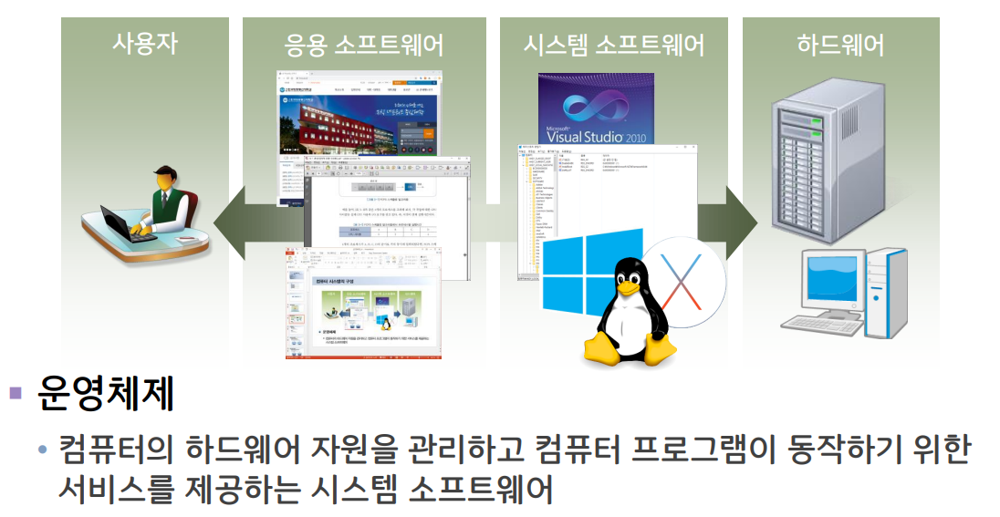
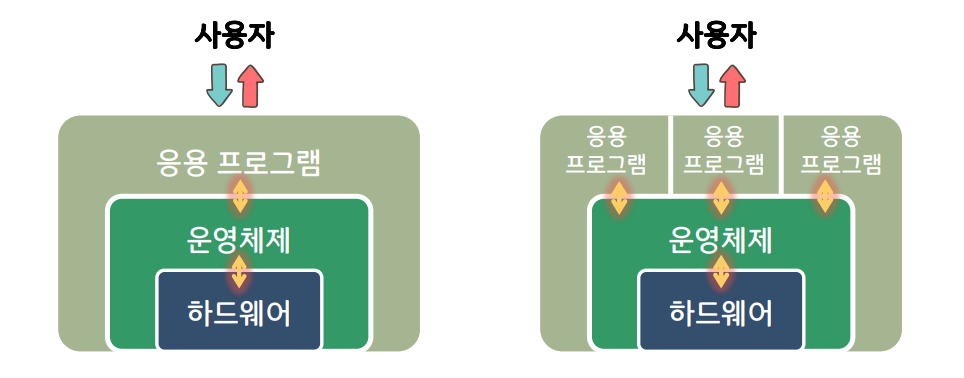

컴퓨터 시스템의 구성

- 소프트웨어
    - 응용 소프트웨어, **시스템 소프트웨어**
- 하드웨어
    - CPU, 메모리, 저장장치 등등
- 펌웨어

---

운영체제의 역할

- 컴퓨터 시스템의 운영
- 사용자 지원

운영체제가 하드웨어와 응용 프로그램 사이에 위치

- 하드웨어에 대한 제어는 운영체제만 함
- 응용 프로그램은 운영체제를 통해서만 하드웨어 이용

CPU의 동작 모드

- 커널 모드 (슈퍼바이저 모드)
    - 운영체제의 커널이 동작되는 모드
    - 하드웨어를 직접 컨트롤이 가능
- 사용자 모드 (보호 모드)
    - 응용프로그램이 동작되는 모드
    - 하드웨어 직접 컨트롤 불가능

사용자 모드 → 커널 모드

- 시스템 호출
    - 응용 프로그램이 운영체제에게 서비스를 요청하는 메커니즘
    - 시스템 호출 → 사용자 모드에서 커널 모드로 변경 → 커널 동작 → 하드웨어 제어

커널

- 운영체제의 핵심요소
- 응용프로그램과 하드웨어 수준의 처리 사이의 가교 역할
- ex) 일체형 커널, 카이크로 커널
    - 일체형 커널
        - 운영체제의 모든 서비스가 커널 내에 포함됨
        - 장점 : 커널 내부 요소들이 서로 효율적으로 상호작용 가능
        - 단점 : 한 요소에서의 오류로 인해 시스템 전체에 장애가 발생
        - 예) UNIX, Linux 운영체제들
    - 마이크로 커널
        - 운영체제의 대부분의 요소들을 커널 외부로 분리
        - 커널 내에는 메모리 관리, 멀티태스킹 등의 최소한의 요소들만 남김
        - 장점 : 유지보수가 용이하며 안정성이 우수함, 확장이 쉬움
        - 단점 : 커널 외부 요소들 사이는 IPC(프로세스간 통신)를 통해야만 하므로 성능 저하