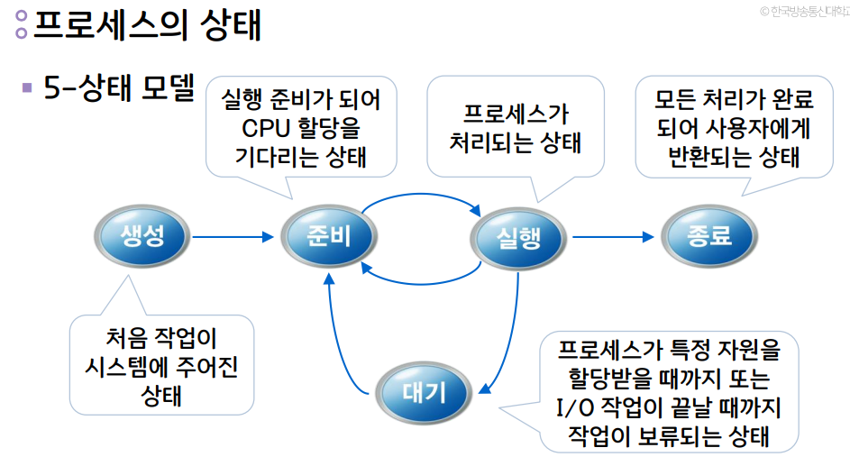
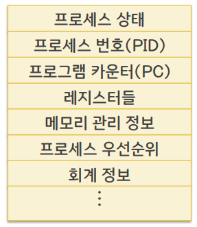
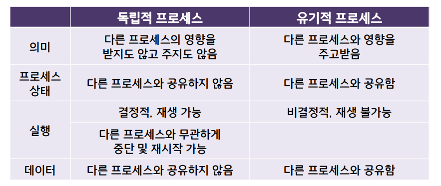

프로세스 : 실행중인 프로그램

- 프로그램 : 동작을 하지 않는 정적,수동적 개체
- 프로세스 : 동작을 하는 능동적 개체

프로세스 관리자의 역할

- 프로세스 생성 및 삭제
- 프로세스 실행(CPU 할당)을 위해 스케줄 설정
- 프로세스 상태를 관리하며 상태 전이를 처리

프로세스 제어 블록 (PCB)

- 프로세스의 관리를 위한 목적
- 프로세스의 정보를 보관
- 각 프로세스마다 존재
- 프로세스가 진행함에 따라 내용 변경

프로세스 생성 작업

- 프로세스의 이름(번호, PID) 결정
- 준비 큐에 삽입
- 초기 우선순위 부여
- 프로세스 제어 블록 (PCB) 생성 등

프로세스 생성 방법 : 시스템 호출

프로세스 간의 관계

