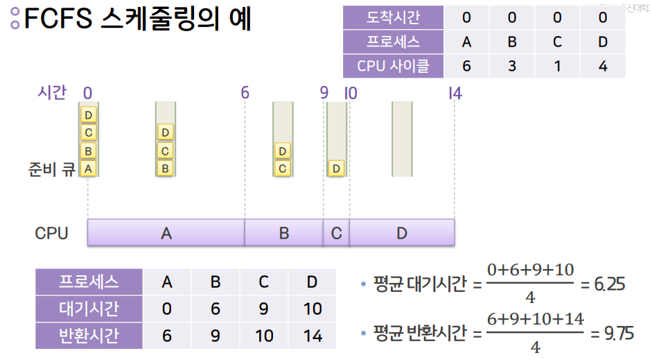
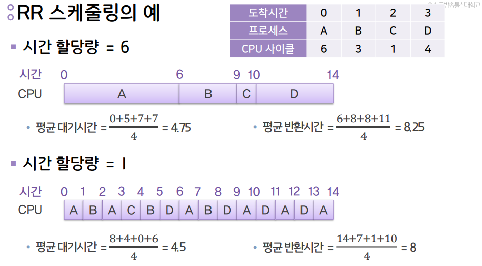

평균 대기시간

- 각 프로세스가 수행이 완료될 때 까지 **준비 큐에서** 기다리는 시간의 합의 평균값

평균 반환시간

- 각 프로세스가 생성된 시점부터 수행이 완료된 시점까지의 소요시간의 평균값
- 프로세스 생성시점~종료시점

## 스케줄링 알고리즘 종류

---

### 1. FCFS 스케줄링

**First-Come First-Served : 큐의 자료구조 (선입선출)**

- 비선점 스케줄링 알고리즘
- 준비 큐에 도착한 순서에 따라 디스패치

- 계산 예시

### 장점

- 가장 간단한 스케줄링 기법

### 단점

- 짧은 프로세스가 긴 프로세스를 기다리거나, 중요하거나 긴급한 프로세스가 나중에 수행될 수 있음

### 특징

- **도착 순서에 따라 평균 대기시간과 평균 반환시간이 계속 달라지므로 예측이 어려움**

---

### 2. SJF (Shortest Job First) 스케줄링

가장 짧게 끝날 작업을 가장 먼저 처리하는 방식

- 비선점 스케줄링 알고리즘
- 준비 큐에서 기다리는 프로세스 중 실행시간이 가장 짧다고 예상된 것을 먼저 디스패치

### 장점

- 일괄처리 환경에서 구현하기 쉬움

### 단점

- 실행 예정 시간 길이를 사용자의 추정치에 의존하기 때문에 실제로는 먼저 처리할 작업의 CPU 시간을 예상할 수 없음
- 최근 프로그램은 실행예정시간을 예측하기 어렵기때문에 사용이 어려움

### 특징

- 작업시간이 너무 긴 프로세스가 들어왔다면 준비큐에서 무한정 기다리게 되는 현상이 발생할 수도있음

---

### 3. SRT (Shortest Remaining Time) 스케줄링

실행이 끝날때까지 남은 시간이 가장 짧은 작업을 먼저 처리하는 방식

- 선점 스케줄링 알고리즘 (CPU 뺏어올 수 있음)
- 실행이 끝날 때까지 남은 시간 추정치가 가장 짧은 프로세스를 먼저 디스패치

### 장점

- SJF보다 평균 대기시간이나 평균 반환시간에서 효율적
- 대화형 운영체제에 유용

### 단점

- 각 프로세스의 실행시간 추적, 선점을 위한 문맥 교환등 SJF보다 오버헤드가 큼

    <aside>
    💡 문맥 교환 : 프로세스가 종료되지 않은 상태에서 선점 스케줄링 방식으로 인해 중간에 뺏긴다면 현재까지 실행했던 여러가지 레지스터 값들을 PCV에 저장함
    </aside>

---

### 4. RR (Round Robin) 스케줄링
미리 정해준 시간 할당량만큼만 사용하고 CPU를 반환해야되는 방식
- 선점 스케줄링 알고리즘
- 준비 큐에 도착한 순서에 따라 디스패치하지만 정해진 시간 할당량에 의해 실행을 제한
- 시간 할당량 안에 완료되지 못한 프로세스는 준비 큐의 맨 뒤에 배치

### 장점
- CPU를 독점하지 않고 공평하게 이용
- 대화형 운영체제에 우용

### 단점
- 시간 할당량이 너무 크면 FCFS 스케줄링과 같아짐
- **시간 할당량이 너무 작으면 문맥 교환에 따른 오버헤드가 크게 증가함**

### 특징
- FCFS 방식 + 시간할당량만큼만 사용 후 반환 (맨 마지막 순서 큐로 들어감)
- 계산 예시
